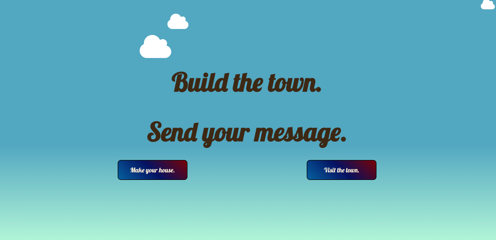
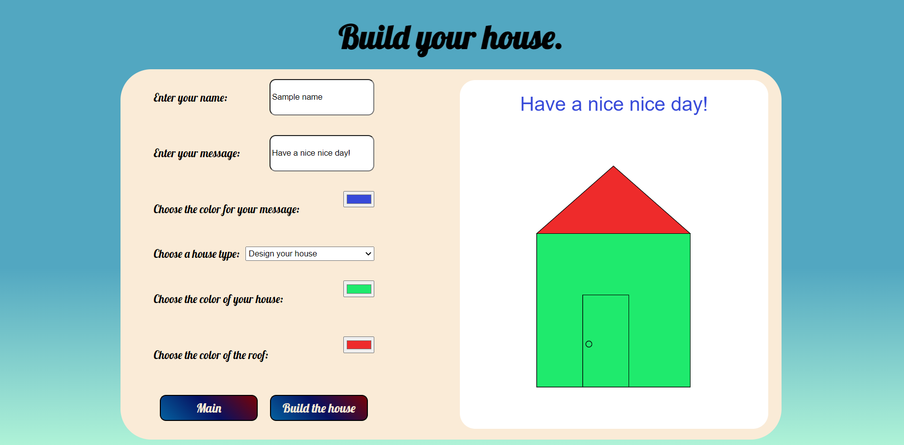
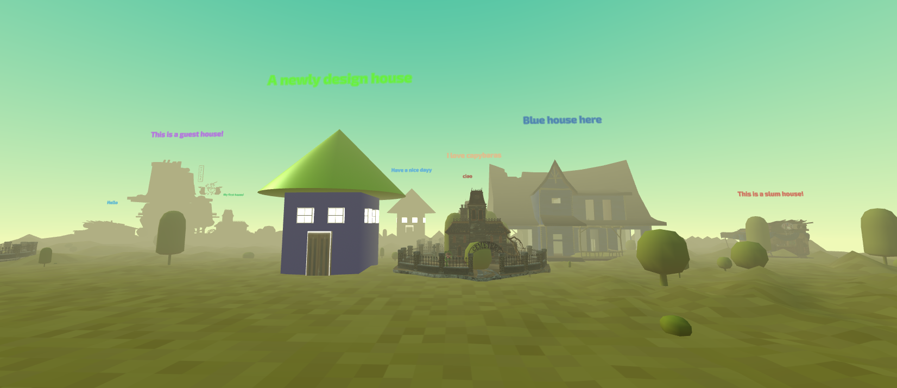

# Building the town. Send your messages.
Github respiratory: https://github.com/LinhTran263/TownBuild
Houses will create a town, messages will create a book.

## Idea
I want this to be a place people can interact in a more visualized zone rather than a simple 2D UI. My intinital idea was having a 3 dimensional town that people can walk around and send mails to the house they wanted. However, since the implementation is quite difficult, I changed it so that every house represents every users and they can send the messages to everyone in the community. In other words, everyone that visits the website can read the motivational quotes/a wish/ anything from strangers. By this, I want to create a community sense on the internet without people actually talking to each other.

## Implementation
My application contains 3 main page: The welcome page, the building page and the 3D town.

### The welcome page
The welcome page simply contains 2 buttons. One button will lead the users to the main town if they do not want to create a new house. Another button will lead to a page that allow the users to build their house that can appear in the town later on.

#### Code Snippet
Below is the code snippets for the design and interactivity of the page. Basically, there are two button. After the event clicking, the page will load to the desired page.
```
    <div class="buttons">
        <button id="house">Make your house.</button>
        <button id="town">Visit the town.</button>    
    </div>

    <script type="text/javascript">
        document.getElementById("house").onclick = function () {
            location.href = "building/index.html";
        };
        document.getElementById("town").onclick = function () {
            location.href = "building/public/index.html";
        };

    </script>
```

For the design of the page, I used the tag ```marquee``` to have a cloud-like shape html element.

```
    <div id="my-clouds">
        <marquee behavior="scroll" direction="right" scrollamount="15">
            <i class="fa fa-cloud" style="color:white;font-size:40px"></i>
        </marquee>
        <marquee behavior="scroll" direction="left" scrollamount="10">
            <i class="fa fa-cloud" style="color:white;font-size:60px"></i>
        </marquee>
        <marquee behavior="scroll" direction="right" scrollamount="5">
            <i class="fa fa-cloud" style="color:white;font-size:90px"></i>
        </marquee>
    </div> 
```
#### Illustration


### The building page
This page is using the cooperation of the database and input boxes from html. To allow the users with the most freedom of their buildings, users are allowed to choose which house they wanted. Most of the option is the preloaded 3D models that they can use it without modifying. One of the option is to build their own house. This option allows users to choose the colors of different parts of the house (base and the roof).

Beside making the house, users will also have to enter their name and their messages. Users can also choose the color of the messages that they want. All if these information will be displayed visually in the white canvas by using p5.js.

#### Code Snippet
The section below is used to display input boxes.
```
    <div class="container" id="container1">
        <section class="input-box">
            <form class="inputspc">
                <p>Enter your name: </p>
                <input type="text" placeholder="name" id="name" required>
            </form>
            <form class="inputspc">
                <p>Enter your message: </p>
                <input type="text" placeholder="message" id="msg" required>
            </form>

            <div class="inputspc">
                <p>Choose the color for your message: </p>
                <input type="color" name="inputspc" id="colormsg">
            </div>

            <div class="inputspc" id="dropdown">
                <label for="zodiac-select" style="margin-right: 10px;">Choose a house type:</label>
    
                <select name="pets" id="zodiac-select">
                    <option value="default">--Please choose a house type--</option>
                    <option value="#slumhouse">Slum House</option>
                    <option value="#guesthouse">Guest house</option>
                    <option value="#redhouse">Red House</option>
                    <option value="#bluehouse">Blue House</option>
                    <option value="#hauntedhouse">Haunted House</option>
                    <option value="#designhouse">Design your house</option>
                </select>
            </div>

            <div class="inputspc" id="colorbase">
                <p>Choose the color of your house: </p>
                <input type="color" name="inputspc" id="color-base">
            </div>
            <div class="inputspc" id="colorroof">
                <p>Choose the color of the roof: </p>
                <input type="color" id="color-roof">
            </div>
            <div class="inputspc" id="colorroof">
                <button type="submit" id="main-button">Main</button>
                <button type="submit" id="submit-button">Visit the town.</button>
            </div>
        </section>
```
Then, I connect with the database and pass all of the users' into a JSON so that I can push it into the database in the server side.
```
        let houseObj = {
            "name": name_input,
            "type": building_type,
            "baseColor": house_color,
            "roofColor": roof_color,
            "msg": msg_input,
            "msgColor": messColor
        };

        let houseObjJSON = JSON.stringify(houseObj);
        console.log(houseObjJSON);


        fetch('/houses',{
            method: 'POST',
            headers: {'Content-Type' : 'application/json'},
            body: houseObjJSON
        })
        .then(res => res.json())
        .then(data => {
            console.log(data);
        })
```
On the server side, along with pushing the data into the database, I also created a random position that the new houses can spawn everytime a new user joins. I made a 2D array that initially contains all 0s. Then, everytime a house is inputed, the position in the array will be generated randomly without collisions. When this happens, the value of that position will be updated to 1. The position data is also pushed into the database.
```
app.post("/houses", (req,res) => {
    let randW = Math.floor(Math.random() * 7);
    let randH = Math.floor(Math.random() * 7);
    do{
        randW = Math.floor(Math.random() * 7);
        randH = Math.floor(Math.random() * 7);
        if (housePos[randW][randH] == 0) break;
        console.log(randW,randH);
    }
    while(housePos[randW][randH] != 0);
    housePos[randW][randH] = 1;
    let obj = {
        house: req.body,
        posX: randW,
        posY: randH
    }
    db.push("userHouses", obj);
    db.get("userHouses").then(houseData =>{
        console.log(houseData);
    })
})
```

Finally, the preview is coded by using p5.js. Everytime the users changing colors, they can see what a preview of the colors they have chose on a white background.
```
//collecting input of colors
    let inputColor = document.getElementById("color-base");
    inputColor.addEventListener("change", ()=>{
        house_color = document.getElementById("color-base").value;
    })

    let roofColor = document.getElementById("color-roof");
    roofColor.addEventListener("change", ()=>{
        roof_color = document.getElementById("color-roof").value;
    })

    let msgColor = document.getElementById("colormsg");
    msgColor.addEventListener("change", ()=>{
        messColor = document.getElementById("colormsg").value;
    })

```
#### Illustration


### The Community Town
Last but not least, it is the 3 dimensional community town. To build this, I used the A-Frame library. The reason that I want to use A-Frame is that I want to have a more visualized representation of each message. Instead of having a line of words, I want people to feel that their presence are in the town since houses mean long-term. Also, houses will create a town, while messages will create a book. All of this can be seen through this website.

#### Code Snippet
I initialized by loading all of the houses into the html page as well as loading the enviroment where all the houses will be located on. This also includes the camera that users can move around.
```
    <a-scene id="scene_asset">
        <a-assets>
            <!-- ... -->
            
            
            <!-- ... -->
            
            <a-asset-item id="slumhouse" src="houses/slumhouse/scene.gltf"></a-asset-item>
            <a-asset-item id="redhouse" src="houses/redhouse/scene.gltf"></a-asset-item>
            <a-asset-item id="bluehouse" src="houses/bluehouse1/scene.gltf"></a-asset-item>
            <a-asset-item id="hauntedhouse" src="houses/hauntedhouse/scene.gltf"></a-asset-item>
            <a-asset-item id="guesthouse" src="houses/guesthouse/scene.gltf"></a-asset-item>
            
            
            


        </a-assets>
    
        <a-entity environment="preset: forest; dressingAmount: 100" width="10000" height="10000"></a-entity>

        <a-sky color="#ECECEC"></a-sky>

        <a-entity position="0 5 5">
            <a-camera active="true">
                <a-entity id="cur" cursor="rayOrigin:mouse"></a-entity>
            </a-camera>
            
        </a-entity>
    </a-scene>
```
All of the house creation is done in javascript. Since I am using the pre-made 3D models from SketchFab, every model has different pivots. Therefore, I have to find the correct positions for the messages and names. Below is an exmaple of how I did it:
```
//the same structure apply for every models through the iteration of the database.
    let item = document.createElement('a-entity');
    item.id = house.house.type + house.house.name;
    item.setAttribute('gltf-model', house.house.type);
    item.setAttribute('position', {x:house.posX * 20 - 80, y:0.5, z:house.posY * 20 - 80});
    if (house.house.type =="#slumhouse"){
        item.setAttribute('scale', {x:1.5, y:1.5, z:1.5});
        text.setAttribute('position', {x:0, y:6, z:0.5});
        text.setAttribute('height', '20');
        text.setAttribute('width', '20');
        msg.setAttribute('height', '20');
        msg.setAttribute('width', '20');
        msg.setAttribute('position', {x:0, y:8, z:0.5});
    }
```
For the option of design your house, I made a simple house that include a base, a roof, a door and 6 windows. The base is the parent of all the other elements and therefore, the position of the children elements is relative to the base. This will make the process of controlling the positions a lot more easier.
```
if (house.house.type == "#designhouse"){
    let asset = document.getElementById("scene_asset");
    let base = document.createElement('a-box');
    base.id = house.house.type + house.house.name;
    base.setAttribute('position', {x:house.posX * 20 - 120, y:0.5, z:house.posY * 20 - 100});
    base.setAttribute('height', 20);
    base.setAttribute('width', 10);
    base.setAttribute('depth', 10);
    base.setAttribute('color', house.house.baseColor);
    console.log(house);

    let roof = document.createElement('a-cone');
    roof.setAttribute('position', {x:0, y:15, z:0});
    roof.setAttribute('radius-bottom', 10);
    roof.setAttribute('height', 10);
    roof.setAttribute('color', house.house.roofColor);

    let door = document.createElement('a-box');
    door.setAttribute('position', {x:0, y:0, z:5});
    door.setAttribute('width', 3);
    door.setAttribute('height', 10);
    door.setAttribute('color', "#FFF");
    door.setAttribute('src', "#door")


    asset.appendChild(base);
    base.appendChild(roof);
    base.appendChild(door);
    base.appendChild(text);
    base.appendChild(msg);

    let winlst = ["-2 7 4.5","2 7 4.5","4.5 7 -2","4.5 7 2","-4.5 7 -2","-4.5 7 2"];
    for (let i = 0; i < winlst.length; i++) {
        let window = document.createElement('a-box');
        window.setAttribute('position', winlst[i]);
        window.setAttribute('scale', {x:2, y:2, z:2})
        window.setAttribute('color', "#FFF");
        window.setAttribute('src', "#window");
        base.appendChild(window);
    }
```
Along with the messages, I also made their names to appear on top of the house. However, since I want them to focus on the messages itself, I made the names to appear only when the users hover on the houses.
```
    let cursor = document.getElementById("cur");
    cursor.addEventListener('mouseenter', function (evt) {
        if (evt.detail.intersectedEl.id != undefined) {
            let text = document.getElementById(evt.detail.intersectedEl.id + "text");
            text.setAttribute('opacity', 1);}
    });

    cursor.addEventListener('mouseleave', function (evt) {
        if (evt.detail.intersectedEl.id != undefined) {
            let text = document.getElementById(evt.detail.intersectedEl.id + "text");
            text.setAttribute('opacity', 0);}
    });
```
In addition to that, to make the user experience easier, I made the rotation animation so that the users can view the house in any angle without having to move around. 

```
    let rotateObj;
    let rotateText;
    let rotateMsg;
    cursor.addEventListener('click', (evt)=>{
        if (evt.detail.intersectedEl.id != undefined) {
            let obj = document.getElementById(evt.detail.intersectedEl.id);
            rotateObj = obj.getAttribute('rotation').y + 90;
            // console.log(rotate);
            obj.setAttribute('animation', "property: rotation; to: 0 " + rotateObj + " 0; dur: 1000");
            let text = document.getElementById(evt.detail.intersectedEl.id + "text");
            rotateText = text.getAttribute('rotation').y + 90;
            text.setAttribute('animation', "property: rotation; to: 0 " + rotateText + " 0; dur: 1000");        
            
            let msg = document.getElementById(evt.detail.intersectedEl.id + "msg");
            rotateMsg = text.getAttribute('rotation').y + 90;
            msg.setAttribute('animation', "property: rotation; to: 0 " + rotateMsg + " 0; dur: 1000");          

        }
    })
```

#### Illustration


## Challenges
* The pivots and scalling of the houses causing a lot of troubles because they are different for each model. Therefore, it is time consuming to adjust the positions of every object in AFrame. My temporary solution to this is making every relating object be the models' children. By this, I just need to adjust the for every model once and run the for loop for every other models. 
* The database sometimes load before the p5.js causing error to the preview scene.

## Overall lessons
Learning AFrame is such an interesting experience and I really want to apply it for VR since they have a mode for that. Aside from that, I just realized how important the relationship of child-parent in html. It was not too clear previously since I can adjust things without make things inside another thing. However, this time, it is a huge advantage because everything models have different pivots. If they do not have this, I will need to calculate the positions differently.

## Next steps
My next steps will be:
* Implemeting the mailing system instead of having the messages appear on the tp.
* Having an account so that people can continue with their house and changing the message without creating a new house.
* Create a map with roads so that it can be more town-like rather than just houses.
