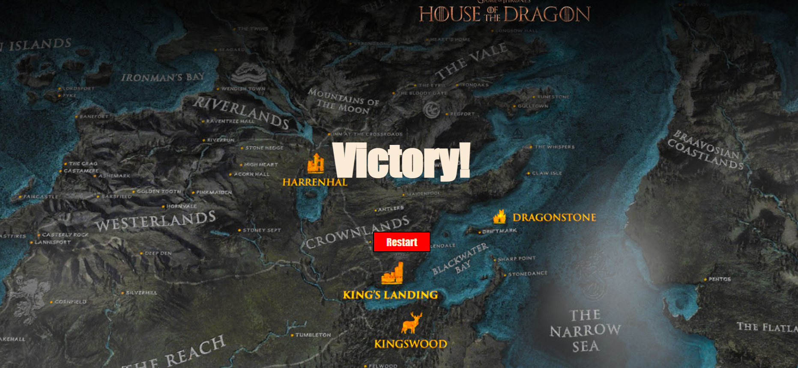

# Dragon Hunt
Game link: https://peat-grove-fukuiraptor.glitch.me/
Code link: https://glitch.com/edit/#!/peat-grove-fukuiraptor (we have not deleted the commented codes since we still want to debug more)

## Inspiration
Taking the theme from the game of thrones, our game will surround the characters in the famous movie. In our game, the players will represent the houses and they will compete with each other. The characters will include the Stark house, the Tagaryan house, and the villain White Walkers.
The mechanism of our game was inspired by my childhood game “Bomb it”. It is a multiplayer game in which the players have to destroy obstacles and kill the opponents.

## The project
As mentioned before, the graphics of our games contain the characters from the Game of Thrones movie/book. For the game mechanism, the players can move around by the key arrows or by “aswd”. The game’s map will generate randomly everytime the page is refreshed and the map will be the same for both players. We are restricting the game to one 2 players. The third person joining will be the “observer” which means that they can not move any characters on the screen but they can still see the progress of the game.

## Progress
First, we initialized the sockets and the connection between the servers and the clients.
```
//initialising express app
let express = require("express");
let app = express();
app.use("/", express.static("public"));
```
### The grid
Then, we created a Grid class based on the code that professor provided. We also make it to be able to generate random map for every time the page is reloaded. We made sure that we generated the random map on the server side so that we can emit the same map to all players of the game. The grid will have paths and obstacles. The players can not pass through the obstacles but can destroy them by shooting it 3 times.
```
class Grid {
    constructor(size, rows, cols) {
        //you can create an actual grid with 0s and 1s and 2s and so on
        // random grid generator
        this.grid =``;
        socket.on("gridNumbers", (data)=>{
            this.grid += data;
        });
        this.grid = this.grid.replace(/\s/g, ""); // IMP : This step removes all the whitespaces in the grid.
        this.size = size;
        this.rows = rows;
        this.cols = cols;
        this.currVal = 0;
    }
  
    gridDraw() {
        //each number in your grid can be a particular element or colour - depends on your game logic
        //loop through the rows and columns and find the grid value at that position in the array
        
        for (let i = 0; i < this.rows; i++) {
            for (let j = 0; j < this.cols; j++) {
                //get the grid value - is it 0 or 1
                let gridVal = this.grid[j * this.rows + i];
        
                // depending on the value, you can give it the appropriate colour/shape/image
                if (gridVal == 0) {
                    fill(200);
                    // background(50);
                    image(ground, i * this.size, j * this.size, this.size, this.size);
                    // rect(i * this.size, j * this.size, this.size, this.size);
                } else if (gridVal == 1) {
                    // fill(128);
                    image(villain, i * this.size, j * this.size, this.size, this.size)
                    // rect(i * this.size, j * this.size, this.size, this.size);
                }
            }
        }
    }
    getCurrValue(x, y) {
        let gridX = floor(x / this.size);
        let gridY = floor(y / this.size);
        // console.log(gridX, gridY, this.grid,gridY * this.cols + gridX, this.grid[gridY * this.cols + gridX]);
        return this.grid[gridY * this.cols + gridX];
    }
    getCoordinates(x,y) {
        let gridX = floor(x / this.size);
        let gridY = floor(y / this.size);

      return [gridX,gridY];
    }
  getIndex(x,y) {
        let gridX = floor(x / this.size);
        let gridY = floor(y / this.size);
        return gridY * this.cols + gridX;
    }
    recolorBlock(x,y) {
        let gridX = floor(x / this.size);
        let gridY = floor(y / this.size);
        let temp = ``;
        for (let i = 0; i < gridY * this.cols + gridX; i++) {
            temp += this.grid[i];
        }
        temp+= `0`;
        for (let i = gridY * this.cols + gridX + 1; i< 64; i++) {
            temp += this.grid[i];
        }
        this.grid = temp;

      
    }
}
```

### The player
Our game will have two player and only two users can control the characters in the game. Any person other than two players will be the observers which means that they can see the characters moving and playing but they can not control any character on the screen. The players have the following functions to control and move them around.
```
function directionUpdate(player, direction) {}
function playerMove(player) {}
function showPlayers() {}
```
By this, we created an object called player and add the information of x-coordinates, y-coordinates, moving direction, player role, and the scores. Using this object, we continuously emit the object to the server and back to the client so that the position of both players can be seen on different screen.
```
let player = {
  role: "",
  direction: 0,
  x: 32,
  y: 32,
  score: 0,
};

socket.emit("clientPlayerUpdated", playerValues); //call after the character moves
```
The players can also shoot bullets to destroy the obstacles and gain points. The bullets are shot by pressing the space and the direction of the bullets will follow the last direction of the characters. We also emit the bullets data to the server and receive back on the client side to display the bullets on every screens. The functions for the bullets are the following:
```
function keyPressed() {
   if (key == " ") {
      if (player.role == "player1" || player.role == "player2") {
        let bullet = {
          x: player.x,
          y: player.y,
          z: player.direction,
          alive: true,
        };
        bullets.push(bullet);
        socket.emit("clientBulletData", bullets);
      }
    } 
  return false;
}

function drawBullet(bullet) {}
function updateBullets() {}

```
### The layout
We designed the layout in html along with the pages for win and lose. The scores are updated whenever a block is hit. The codes we implemented it as follow:
```
if (gameGrid.grid[blockIndex] == 1) {
  blocksCounter[blockIndex]++;
  if (blocksCounter[blockIndex] > 2) {
    gameGrid.recolorBlock(bullet.x, bullet.y);
    socket.emit("update grid", gameGrid);
    player.score += 1;
```
## Difficulties and Solutions
Initially, we do not know how to make the server recognize the two separate players. The way we initial did was having 2 functions for the 2 different players. To distinguish between 2 players, we used socket.id to recognize the two players. However, this way has a few problem. Only the second player who joins recognize the first player, the player never recognize the newly join second player. This create a problem that player 2 can see player 1 but player 1 can not see player 2. Secondly, since we did not know the different between `socket.emit` and `io.emit`, we were confused why only 1 screen is getting updated with the grid.

However, this was resolved by acknowledging the different bewteen them and using `socket.broadcast.emit("serverPlayerUpdated",playerValues, 1);`, we have successfully emit the positions of both players to both screens accordingly. The grid was also resolved by creating the grid on the server side instead of the client side and then emit all of the information to the server side. Our initial mistake with the grid was that only emit it when there are two people. However, this way is incorrect since the first player joins will never have 2 player in the game. Therefore, the grid will never be emitted to the first player.

## Challenges

Another problem that we are having is that the characters are glitching whenever there are 2 players moving at the same time. We cannot debug successfully to know why that is the case.

The last challenge is that when we setted the conditions for when the game stops. However, it was not so successful whenever we set the condition, the code reacts weirdly. 

## The game itself
Below is the layout of the game:


We also created the html pages for winnng and losing but due to some issues wth the codes, we could not make the page changes with the conditions are met.



## Next steps
Our next steps will be trying to fix the existing bugs about the character movements and winning/losing conditions. Also, we have a lot a ideas that can be applied to this game in the future such as being able to have bonuses and set the bomb timers. Also, if it is poissble, we want this game to have more players at the same time not just 2. Furthermore, we want it to be more eralistic and aesthetic in terms of maps and characters.

## Individual works
###Together
We did a lot of things together. We made the character controllers emission of charater data at first. However, since it was not the correct way to do it, we have to rewrite the codes. Then we tried to debug in our own time and together whenever we can meet.

### Linh
I did the html pages as well as asking for opinions from Yahia to have agreements on the design. Also, I tried to do emission of data for bullets and characters at first but it was not too successful. I developed to scoring system for the game and display it by emitting the score information to the server and emit it back the client side. THere is a small issue with the display of score since the score kind of updating occassionally. It seems that some conditions were se wrong but I have no idea where although I spent a lot of time to debug it. 
