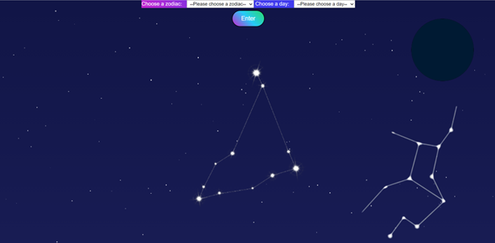
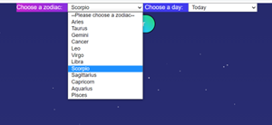
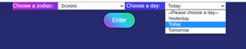
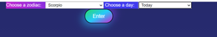
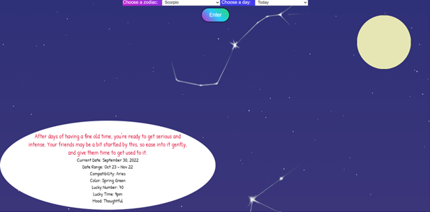
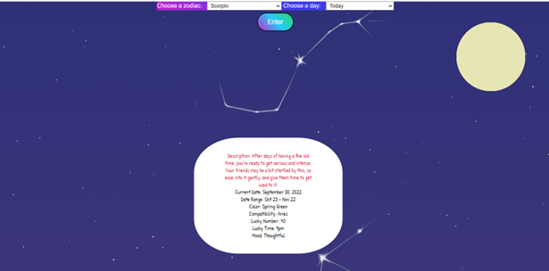

# Connections Lab
<h1> Zodiac signs </h1>
<h2> Initial Ideas </h2>

By using API from RapidAPI, I found an API about astrology. This will inclue information about different zodiac signs as well as quote of the day.
The user interaction I am intending to include is for the users to input the zodiac sign of their choice and the screen will display the information. Besides the data of the zodiac signs, I am going to use p5.j to draw the shape of the stars and it will move accordingly as the zodiac signs change. 

The second interaction is that there will be calendar that allow the the users to easier navigate the information in around 3 days since the API only have data for "yesterday", "today", and "tomorrow". Also, I will randomly pick a quote of a day in the zodiac signs' quotes to display on the calendar.

<h2> Ideas and Implementation </h2>

<b>First Idea:</b> I will draw the constellations of the zodiac signs by p5.js. However, I cannot find any API that have the data of the constellations. Furthermore, I realized that if I can find one, it will not fit to my webpage since the the scales of the website are different.

<b>Solution:</b> I used the images of constellations on the Internet. Before adding the images to my website, I removed all of the background and uncessary details. Then I tried to make the images to appear randomly on the webpage without any overlay. However, I failed to make it not to be overlay (solution will be propsed at the end)

<b>Second Idea:</b> I planned to use the p5.js to draw the stars, that will appear randomly on the screen and when it is hover, iformation that is stored will appear on the screen. owever, after a few attempts, I decided to not use it since it does not match with what I wanted.
 

<b>Second Solution:</b>Therefore, I switched to use CSS and JavaScript to create blinking stars in the background which I believed to be more suitable with the theme. By creating multiple small circles that change the opacity everytime, the background has the effect of the starry sky
 

<b>Third Idea:</b> I used to use an input box for the users to input the zodiac that they want and the time that they want to see it. However, after the user testing day, I recieved comments that since it only has a limited amount of input, typing will make it inconvenient for the users. Also, using the input box with a limited amount of data will require me to have validation check for input.

<b>Third Solution:</b>I replaced the input boxes with a drop down lists. One will contain 12 zodiac signs that the user can pick and the other contains options of time, "yesterday", "today", and "tomorrow". The choices will be collected and extract data from the API after clicking the"Enter" button.

  

  

<b>Fourth Idea:</b> Similar to the first idea, I tried to make the data from the API appear on the p5.js canvas when hovering. However, it does not appear properly, my guess it that the continuous loop of drawing avoiding that.

<b>Fourth Solution:</b> I made a separate div in html and fed data in to it so that it can display the data whenever the user click enter. Also, for the convenience of the user, I made the page to scroll to the constellation positions. Furthermore, instead of making the information box always displays on the screen, I made them to disappear after the user click anywhere on the screen. This will allow users to look through the constellations and the whole page in general.
  

  
 
Along with the presentation of data, I also stored the data at the location of the constellations. The user just needs to hover over the constellation to see the information. This will allow users to check the information again without have to re-enter the inputs.

 
 
 

<b>Fifth Idea:</b> I initially drew the moon with CSS, it just simply a div with rounded corners. However, since I need to include the p5.js elements in my website, I decided to draw the moon by p5.js.

<b>Fifth Solution:</b> 
